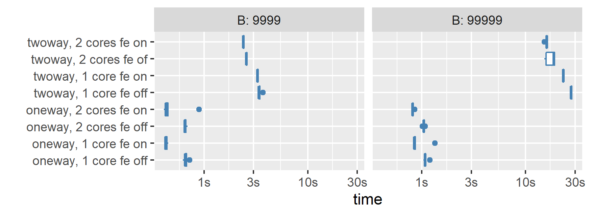

<!-- README.md is generated from README.Rmd. Please edit that file -->

```{r, include = FALSE}
knitr::opts_chunk$set(
  collapse = TRUE,
  comment = "#>",
  fig.path = "man/figures/README-",
  out.width = "100%"
)
```

# fwildclusterboot 


<!-- badges: start -->
<!-- [](commits/master) -->
[](https://lifecycle.r-lib.org/articles/stages.html)
[](https://CRAN.R-project.org/package=fwildclusterboot)

[](https://github.com/s3alfisc/fwildclusterboot/actions)
[](https://app.codecov.io/gh/s3alfisc/fwildclusterboot?branch=master)
`r badger::badge_cran_download("fwildclusterboot", "grand-total", "blue")`
`r badger::badge_cran_download("fwildclusterboot", "last-month", "green")`
<!-- [](https://cran.r-project.org/) -->

<!-- badges: end -->

The `fwildclusterboot` provides a native R implementation of the fast wild cluster bootstrap algorithm developed in [Roodman et al (2019)](https://econpapers.repec.org/paper/qedwpaper/1406.htm) for regression objects in R. It also ports functionality of [WildBootTests.jl](https://github.com/droodman/WildBootTests.jl) to R via the [JuliaConnectoR](https://github.com/stefan-m-lenz/JuliaConnectoR).

The package's central function is `boottest()`. It allows the user to test univariate hypotheses using a wild cluster bootstrap at extreme speed.

`fwildclusterboot` supports the following features:

+ The wild bootstrap for OLS (Wu 1986).
+ The subcluster bootstrap (MacKinnon and Webb 2018).
+ Confidence intervals formed by inverting the test and iteratively searching for bounds.
+ Multiway clustering.
+ One-way fixed effects.

Additional features are provided through `WildBootTests.jl`:

+ The Wild Restricted Efficient bootstrap (WRE) for IV/2SLS/LIML ([(Davidson & MacKinnon, 2010)](https://www.tandfonline.com/doi/abs/10.1198/jbes.2009.07221)).
+ Arbitrary and multiple linear hypotheses in the parameters.

`fwildclusterboot` supports the following models: 

+ OLS: `lm` (from stats), `fixest` (from fixest), `felm` from (lfe)
+ IV: `ivreg` (from ivreg). 

<!-- The following features will be added in the future:  -->

<!-- * support for multivariate hypotheses  -->
<!-- * bootstrap distributions beyond the rademacher distribution -->


```{r, echo=FALSE, include=FALSE, results="hide", execute = FALSE}
# setwd("C:/Users/alexa/Dropbox")
# devtools::install("fwildclusterboot")
# devtools::document("fwildclusterboot")
# devtools::test("C:/Users/alexa/Dropbox/fwildclusterboot")
# usethis::use_github_actions()
# usethis::use_github_action(“render-readme.yaml”)
#usethis::use_github_actions_badge(name = "R-CMD-check", repo_spec = NULL)#

# usethis::use_mit_license("C:/Users/alexa/Dropbox/fwildclusterboot")
# # # cmd check r 
# # Sys.setenv('_R_CHECK_SYSTEM_CLOCK_' = 0)
# # #system("defaults write org.R-project.R force.LANG en_US.UTF-8") # restart R
# # Sys.getlocale()
# # Sys.setlocale("LC_MESSAGES", "C")
# # #Sys.setenv(LANG = "en_US.UTF-8")
# Sys.getlocale()

# # install
# setwd("C:/Users/alexa/Dropbox")
# devtools::install("fwildclusterboot")
# devtools::document("fwildclusterboot")
# devtools::test("C:/Users/alexa/Dropbox/fwildclusterboot")
# devtools::test("C:/Users/alexa/Dropbox/fwildclusterboot")
# devtools::check("C:/Users/alexa/Dropbox/fwildclusterboot")


# execute all functions in fwildclusterboot 
# setwd("C:/Users/alexa/Dropbox/fwildclusterboot/R")
# file.sources = list.files(pattern="*.R")
# sapply(file.sources, source, .GlobalEnv)

```

### The `boottest()` function

```{r}
# note: for performance reasons, the sampling of the bootstrap weights of types Rademacher, Webb and Normal within
# fwildclusterboot are handled via the dqrng package, which is installed with the
# package as a dependency. To set a global seed for boottest() for these weight types, use dqrng's dqset.seed() function
# For Mammen weights, one can set a global seed via the set.seed() function.

# set global seed for Rademacher, Webb and Normal weights
library(dqrng)
dqrng::dqset.seed(965326)
# set a global seed for Mammen weights
set.seed(23325)

library(fwildclusterboot)

data(voters)

# fit the model via fixest::feols(), lfe::felm() or stats::lm()

lm_fit <- lm(proposition_vote ~ treatment  + log_income + as.factor(Q1_immigration) + as.factor(Q2_defense), data = voters)
# bootstrap inference via boottest()
lm_boot <- boottest(lm_fit, clustid = c("group_id1"), B = 9999, param = "treatment", seed = 1)
summary(lm_boot)

library(fixest)
feols_fit <- feols(proposition_vote ~ treatment  + log_income | Q1_immigration + Q2_defense, data = voters)
# bootstrap inference via boottest()
feols_boot <- boottest(feols_fit, clustid = c("group_id1"), B = 9999, param = "treatment", seed = 1)
summary(feols_boot)

```

For a longer introduction to the package's key function, `boottest()`, please follow this [link](https://s3alfisc.github.io/fwildclusterboot/articles/fwildclusterboot.html).

### Benchmarks

Results of timing benchmarks of `boottest()`, with a 
sample of N = 10000, k = 20 covariates and one cluster of dimension N_G (3 iterations each, median runtime is plotted).
  

```{r, fig.width=10, fig.height=3, echo = FALSE, warning = FALSE, message = FALSE}
library(ggplot2)
library(scales)
library(data.table)

benchmarks_clean2 <- fread("C:/Users/alexa/Dropbox/R package development/wildboottestjlr/benchmarks_df")
benchmarks_clean2 <- benchmarks_clean2[type != "wildboottestjlr"]

benchmarks_clean2[, N_G := factor(N_G, levels = c("N_G = 20", "N_G = 50", "N_G = 100", "N_G = 500", "N_G = 1000"))]
benchmarks_clean2[, B := factor(B, levels = c("10K", "100K"))]

ggplot(data = benchmarks_clean2, aes(x = B, y = time, group = factor(type))) + 
  facet_wrap(~N_G, nrow = 1) + 
  geom_point(aes(colour = factor(type)), size = 2) + 
  geom_line(aes(colour = factor(type))) + 
  scale_y_continuous(labels = comma, trans = 'log10') +
  # scale_x_continuous(labels = label_number(scale = 1/1000, suffix = "K"), breaks = breaks_width(50000))  +
  ylab("time in seconds (log scale)") +
  xlab("number of bootstrap iterations") +
  theme_bw()+
  theme(axis.text.x = element_text(angle = 90, vjust = 0.5, hjust=1),
        legend.title = element_blank())

# benchmarks_clean <- 
# readRDS("C:/Users/alexa/Dropbox/fwildclusterboot develop/benchmarks_clean.rds")
# 
# ggplot(data = benchmarks_clean, aes(x = B, y = mean, group = factor(expr))) +
#   facet_wrap(~N_G, nrow = 1) +
#   geom_point(aes(colour = factor(expr)), size = 2) +
#   geom_line(aes(colour = factor(expr))) +
#   #geom_bar(stat = "identity", position = position_dodge()) +
#   #scale_y_continuous(labels = comma) +
#   scale_y_continuous(labels = comma, trans = 'log10') +
#   scale_x_continuous(labels = label_number(scale = 1/1000, suffix = "K"), breaks = breaks_width(50000))  +
#   ylab("time in seconds (log scale)") +
#   xlab("number of bootstrap iterations") +
#   theme_bw()+
#   theme(axis.text.x = element_text(angle = 90, vjust = 0.5, hjust=1),
#         legend.title = element_blank())

```

<!-- For a small number of clusters, `fwildclusterboot` is in generally faster than implementations of the wild cluster bootstrap in the `sandwich` and `clusterSEs` packages.  -->

```{r, include = FALSE}
# All defaults
# knitr::include_graphics("man/figures/benchmarks.png")
```
<!--  -->


### Installation

You can install compiled versions of`fwildclusterboot` from CRAN and the development version from R-universe (compiled) or github by following one of the steps below:

```{r, eval = FALSE}
# from CRAN 
install.packages("fwildclusterboot")

# from r-universe (windows & mac, compiled R > 4.0 required)
install.packages('fwildclusterboot', repos ='https://s3alfisc.r-universe.dev')

# dev version from github
# note: installation requires Rtools
library(devtools)
install_github("s3alfisc/fwildclusterboot")
```

To run `WildBootTests.jl` through `fwildclusterboot`, `Julia` and `WildBootTests.jl` need to be installed. 

You can install Julia by following the steps described on the official `Julia` homepage: https://julialang.org/downloads/. 
`WildBootTests.jl` can then be installed via Julia's package management system. 

To install `WildBootTests.jl` and Julia from within R, you can use `fwildclusterboot's` `fwildclusterboot_setup()` function, which guides you through installing Julia and `WildBootTests.jl` and helps to connect R and Julia.  

```{r, eval = FALSE}
fwildclusterboot_setup()
```

