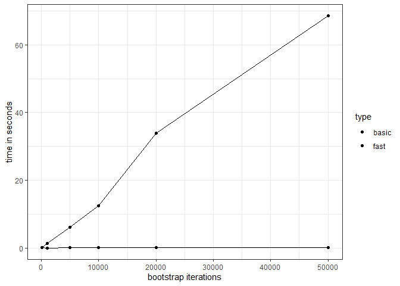

<!-- README.md is generated from README.Rmd. Please edit that file -->

# fwildclusterboot

<!-- badges: start -->
<!-- [, Shake and Throw-orange.svg?style=flat-square)](commits/master) -->

[](https://lifecycle.r-lib.org/articles/stages.html)
[](https://CRAN.R-project.org/package=fwildclusterboot)
[](https://github.com/s3alfisc/fwildclusterboot/actions)
[](https://codecov.io/gh/s3alfisc/fwildclusterboot?branch=master)
[](https://cran.r-project.org/package=fwildclusterboot)
[](https://cran.r-project.org/package=fwildclusterboot)

<!-- [](https://cran.r-project.org/) -->
<!-- badges: end -->

The `fwildclusterboot` package is an R port of STATA’s
[boottest](https://github.com/droodman/boottest) package.

It implements the fast wild cluster bootstrap algorithm developed in
[Roodman et al
(2019)](https://econpapers.repec.org/paper/qedwpaper/1406.htm) for
regression objects in R. It currently works for regression objects of
type `lm`, `felm` and `fixest` from base R and the `lfe` and `fixest`
packages.

The package’s central function is `boottest()`. It allows the user to
test two-sided, univariate hypotheses using a wild cluster bootstrap.
Importantly, it uses the “fast” algorithm developed in Roodman et al,
which makes it feasible to calculate test statistics based on a large
number of bootstrap draws even for large samples – as long as the number
of bootstrapping clusters is not too large.

The `fwildclusterboot` package currently supports multi-dimensional
clustering and one-dimensional, two-sided hypotheses. It supports
regression weights, multiple distributions of bootstrap weights, fixed
effects, restricted (WCR) and unrestricted (WCU) bootstrap inference and
subcluster bootstrapping for few treated clusters [(MacKinnon & Webb,
(2018))](https://academic.oup.com/ectj/article-abstract/21/2/114/5078969).

<!-- The following features will be added in the future:  -->
<!-- * support for multivariate hypotheses  -->
<!-- * bootstrap distributions beyond the rademacher distribution -->

### The `boottest()` function

``` r
library(fixest)
library(fwildclusterboot)

data(voters)

# fit the model via fixest::feols(), lfe::felm() or stats::lm()
feols_fit <- feols(proposition_vote ~ treatment  + log_income | Q1_immigration + Q2_defense, data = voters)

# bootstrap inference via boottest()
feols_boot <- boottest(feols_fit, clustid = c("group_id1"), B = 9999, param = "treatment")

summary(feols_boot)
#> boottest.fixest(object = feols_fit, clustid = c("group_id1"), 
#>     param = "treatment", B = 9999)
#>  
#>  Observations: 300
#>   Bootstr. Type: rademacher
#>  Clustering: 1-way
#>  Confidence Sets: 95%
#>  Number of Clusters: 40
#> 
#>        term estimate statistic p.value conf.low conf.high
#> 1 treatment    0.079     4.123       0    0.039     0.118
```

For a longer introduction to the package’s key function, `boottest()`,
please follow this
[link](https://s3alfisc.github.io/fwildclusterboot/articles/fwildclusterboot.html).

### Benchmarks

Results of timing benchmarks of `boottest()`, with a sample of N =
50000, k = 19 covariates and one cluster of dimension N\_G (10
iterations each).



<!--  -->

### Installation

You can install `fwildclusterboot` from CRAN or the development version
from github by following the steps below:

``` r
# from CRAN 
install.packages("fwildclusterboot")

# dev version from github
# note: installation requires Rtools
library(devtools)
install_github("s3alfisc/fwildclusterboot")
```
