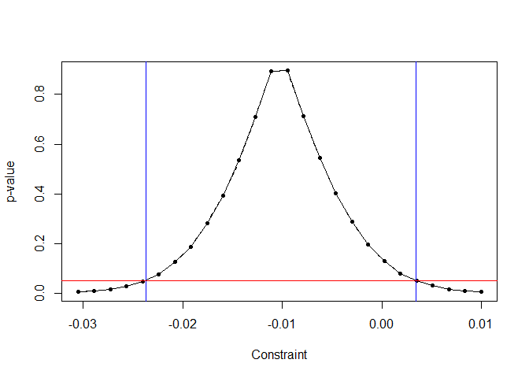

<!-- README.md is generated from README.Rmd. Please edit that file -->

# fwildclusterboot

<!-- badges: start -->

[](https://www.tidyverse.org/lifecycle/#experimental)
[](https://CRAN.R-project.org/package=fwildclusterboot)
<!-- badges: end -->

The `fwildclusterboot` package is an R port of Stata’s `boottest`
package.

It implements the fast wild cluster bootstrap algorithm developed in
Roodman et al (2019) for regression objects in R. It currently works for
regression objects of type `lm`, `felm` and `fixest` from base R and the
`lfe` and `fixest` packages.

The package’s central function is `boottest()`. It allows the user to
test two-sided, univariate hypotheses using a wild cluster bootstrap.
Importantly, it uses the “fast” algorithm developed in Roodman et al,
which makes it feasible to calculate test statistics based on a large
number of bootstrap draws even for large samples--as long as the 
number of bootstrapping clusters is not too large.

The `fwildclusterboot` package currently only supports one-dimensional
clustering and one-dimensional hypotheses, but allows for an arbitrary
number of fixed effects.

The package is highly experimental and currently does not include any
unit tests.

The following will be added in the future: - support for clustering of
higher dimensions - support for multivariate hypotheses - bootstrap
distributions other then the rademacher distribution

## Installation

You can install the released version of `fwildclusterboot` from github
by running

``` r
library(devtools)
#> Loading required package: usethis
#install_github("al_fisc/fwildclusterboot")
```

## The `boottest()` function

In a first step, simulate a data set with 10000 individual observations
that are grouped in 50 clusters and with a small intra-cluster
correlation of 0.01. The small intra-cluster correlation implies that,
in theory, inference based on cluster-robust covariance estimates should
lead to results that are very similar to the bootstrap.

``` r
library(fwildclusterboot)


B <- 1000
seed <- 2180019
set.seed(seed)
voters <- create_data_1(N = 10000, N_G = 50, icc = 0.01)
head(voters)
#>       ID group_id    ideology ideological_label     income       Q1_immigration
#> 1: 00001        1 -0.41359792      Conservative 4209683.68 Don't Know / Neutral
#> 2: 00002        2 -0.03513429      Conservative   18457.05 Don't Know / Neutral
#> 3: 00003        3 -0.48570812      Conservative  102603.50 Don't Know / Neutral
#> 4: 00004        4  0.74136367           Liberal   10540.71           Lean Agree
#> 5: 00005        5  0.12212610           Liberal   35976.17 Don't Know / Neutral
#> 6: 00006        6  1.07708145      Very Liberal   21126.00           Lean Agree
#>    treatment proposition_vote log_income
#> 1:         0                0  15.252898
#> 2:         1                1   9.823202
#> 3:         0                0  11.538627
#> 4:         0                1   9.263000
#> 5:         0                1  10.490612
#> 6:         0                1   9.958260
```

The `fwildclusterboot` package supports estimation of linear models
based on - `lm()` from `base` R - `felm()` from `lfe` - `feols()` from
`fixest`

``` r
library(lfe)
library(fixest)

# 1) boottest based on object of class lm
lm_fit <- lm(proposition_vote ~ treatment + ideology + log_income + Q1_immigration , weights = NULL, data = voters)

# 2) boottest based on object of class fixest
feols_fit <- feols(proposition_vote ~ treatment + ideology + log_income , fixef = c("Q1_immigration"), weights = NULL, data = voters)
feols_fit1 <- feols(proposition_vote ~ treatment + ideology + log_income + Q1_immigration, weights = NULL, data = voters)
feols_fit2 <- feols(proposition_vote ~ treatment + ideology + log_income + as.factor(Q1_immigration), weights = NULL, data = voters)

# 3) bootest based on object of class felm
felm_fit <- felm(proposition_vote ~ treatment + ideology + log_income | Q1_immigration, weights = NULL, data = voters)
felm_fit1 <- felm(proposition_vote ~ treatment + ideology + log_income + Q1_immigration, weights = NULL, data = voters)
```

The `boottest` function always calculates p-values for a given
univariate hypothesis test. Second and by default, the boottest function
calculates confidence intervals by inversion of the p-value. The user
can considerably speed up the inference procedure by setting the
argument `conf_int = FALSE`, in which case no confidence intervals are
computed.

``` r
# 1) boottest based on object of class lm
boot_lm = boottest(lm_fit, clustid = voters$group_id, B = B, seed = seed, param = "treatment", conf_int = TRUE)

# 2) bootest based on object of class feols
boot_fixest = boottest(feols_fit, clustid = voters$group_id, B = B, seed = seed, param = "treatment", conf_int = TRUE)
boot_fixest1 = boottest(feols_fit1, clustid = voters$group_id, B = B, seed = seed, param = "treatment", conf_int = TRUE, beta = 0, alpha = 0.05)
# boot_fixest2 = boottest(feols_fit2, clustid = voters$group_id, B = B, seed = seed, param = "treatment", conf_int = TRUE, beta = 0)

# 3) boottest based on object of class felm
boot_felm = boottest(felm_fit, clustid = voters$group_id, B = B, seed = seed, param = "treatment", conf_int = TRUE)
boot_felm1 = boottest(felm_fit1, clustid = voters$group_id, B = B, seed = seed, param = "treatment", conf_int = TRUE)
```

The function `summarize_boot` collects the results. Boottest further
comes with a `tidy` method which, in analogy with the `broom` package,
returns the estimation results as a data.frame.

``` r
summarize_boot(boot_lm)
#>  
#>   Estimation Function: lm
#>  Observations:10000
#>  Standard-errors: Clustered  
#>  Number of Clusters:  50
#> 
#>           Estimate t value Pr(>|t|) CI Lower CI Upper
#> treatment    0.004   0.415    0.671   -0.015    0.024

tidy(boot_lm)
#>              Estimate   t value Pr(>|t|)    CI Lower   CI Upper
#> treatment 0.004085139 0.4147138    0.671 -0.01504625 0.02395238
```

Change the confidence level:

``` r
boot_lm_5 = boottest(lm_fit, clustid = voters$group_id, B = B, seed = seed, param = "treatment", conf_int = TRUE, beta = 0, alpha = 0.05)

boot_lm_20 = boottest(lm_fit, clustid = voters$group_id, B = B, seed = seed, param = "treatment", conf_int = TRUE, beta = 0, alpha = 0.20)

summarize_boot(boot_lm_5)
#>  
#>   Estimation Function: lm
#>  Observations:10000
#>  Standard-errors: Clustered  
#>  Number of Clusters:  50
#> 
#>           Estimate t value Pr(>|t|) CI Lower CI Upper
#> treatment    0.004   0.415    0.671   -0.015    0.024
summarize_boot(boot_lm_20)
#>  
#>   Estimation Function: lm
#>  Observations:10000
#>  Standard-errors: Clustered  
#>  Number of Clusters:  50
#> 
#>           Estimate t value Pr(>|t|) CI Lower CI Upper
#> treatment    0.004   0.415    0.671   -0.008    0.017
```

Plot the confidence sets:

``` r
plot_boot(boot_lm)
```



## Comparison to `cluster.boot()` from `multiwayvcov`

The `multiwayvcov` package offers an alternative implementation of the
wild bootstrap. As can be seen, `multiwayvcov::cluster.boot()`,
`boottest()` and sandwich standard errors produce similar results:

``` r
library(multiwayvcov)
library(lmtest)
res <- cluster.boot(lm_fit, cluster = voters$group_id, parallel = TRUE, R = 1000, wild_type = "rademacher")

# 1) results from multiwayvcov
coeftest(lm_fit, res)
#> 
#> t test of coefficients:
#> 
#>                                      Estimate Std. Error  t value  Pr(>|t|)    
#> (Intercept)                         0.8898613  0.0520122  17.1087 < 2.2e-16 ***
#> treatment                           0.0040851  0.0096984   0.4212    0.6736    
#> ideology                            0.3044786  0.0154906  19.6557 < 2.2e-16 ***
#> log_income                         -0.0032876  0.0031679  -1.0378    0.2994    
#> Q1_immigrationDisagree             -0.2440361  0.0181748 -13.4272 < 2.2e-16 ***
#> Q1_immigrationLean Disagree        -0.3774845  0.0295260 -12.7848 < 2.2e-16 ***
#> Q1_immigrationDon't Know / Neutral -0.3603392  0.0452919  -7.9559 1.971e-15 ***
#> Q1_immigrationLean Agree           -0.3350370  0.0574568  -5.8311 5.677e-09 ***
#> Q1_immigrationAgree                -0.4726871  0.0685724  -6.8933 5.782e-12 ***
#> Q1_immigrationStrong Agree         -0.7404004  0.0825501  -8.9691 < 2.2e-16 ***
#> ---
#> Signif. codes:  0 '***' 0.001 '**' 0.01 '*' 0.05 '.' 0.1 ' ' 1

# 2) results from fwildclusterboot
summarize_boot(boot_lm)
#>  
#>   Estimation Function: lm
#>  Observations:10000
#>  Standard-errors: Clustered  
#>  Number of Clusters:  50
#> 
#>           Estimate t value Pr(>|t|) CI Lower CI Upper
#> treatment    0.004   0.415    0.671   -0.015    0.024
summarize_boot(boot_fixest)
#>  
#>   Estimation Function: fixest
#>  Observations:10000
#>  Standard-errors: Clustered  
#>  Number of Clusters:  50
#> 
#>           Estimate t value Pr(>|t|) CI Lower CI Upper
#> treatment    0.004   0.415    0.671   -0.015    0.024

# 3) sandwich standard errors from fixest
summary(feols_fit, se = "cluster", cluster = "group_id")
#> OLS estimation, Dep. Var.: proposition_vote
#> Observations: 10,000 
#> Fixed-effects: Q1_immigration: 7
#> Standard-errors: Clustered (group_id) 
#>             Estimate Std. Error   t value  Pr(>|t|)    
#> treatment   0.004085   0.009955  0.410361   0.68333    
#> ideology    0.304479   0.016417 18.546000 < 2.2e-16 ***
#> log_income -0.003288   0.003333 -0.986342  0.328811    
#> ---
#> Signif. codes:  0 '***' 0.001 '**' 0.01 '*' 0.05 '.' 0.1 ' ' 1
#> Log-likelihood: -5,295.64   Adj. R2: 0.32399 
#>                           R2-Within: 0.0413
```

## Benchmark

Results of timing benchmarks of `fwildclusterboot` with `multiwayvcov`
(on 4 cores) with - N = 10000 observations - b = 10000 bootstrap
iterations - n\_g = 40 clusters


