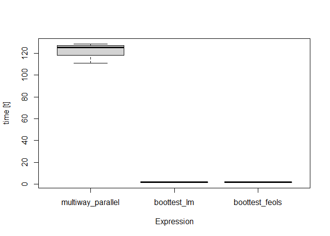

<!-- README.md is generated from README.Rmd. Please edit that file -->

# fwildclusterboot

<!-- badges: start -->

[](https://www.tidyverse.org/lifecycle/#experimental)
[](https://CRAN.R-project.org/package=fwildclusterboot)
<!-- badges: end -->

The `fwildclusterboot` package is an R port of Stata’s `boottest`
package.

It implements the fast wild cluster bootstrap algorithm developed in
Roodman et al (2019) for regression objects in R. It currently works for
regression objects of type `lm`, `felm` and `fixest` from base R and the
`lfe` and `fixest` packages.

The package’s central function is `boottest()`. It allows the user to
test two-sided, univariate hypotheses using a wild cluster bootstrap.
Importantly, it uses the “fast” algorithm developed in Roodman et al,
which makes it feasible to calculate test statistics based on a large
number of bootstrap draws even for large samples–as long as the number
of bootstrapping clusters is not too large.

The `fwildclusterboot` package currently supports one- and
two-dimensional clustering and one-dimensional hypotheses.

The package is highly experimental and only includes few unit tests.

The following features will be added in the future:

  - support for multivariate hypotheses
  - bootstrap distributions beyond the rademacher distribution

## The `boottest()` function

In a first step, simulate a data set with 10000 individual observations
that are grouped in 50 clusters and with a small intra-cluster
correlation of 0.01. The small intra-cluster correlation implies that,
in theory, inference based on cluster-robust covariance estimates should
lead to results that are very similar to the bootstrap.

``` r
library(fwildclusterboot)

B <- 10000
seed <- 942413
set.seed(seed)
voters <- create_data_2(N = 10000, N_G1 = 20, icc1 = 0.01, N_G2 = 40, icc2 = 0.01, numb_fe1 = 10, numb_fe2 = 10, seed = seed)
```

The `fwildclusterboot` package supports estimation of linear models
based on - `lm()` from `base` R - `felm()` from `lfe` - `feols()` from
`fixest`

``` r
lm_fit <- lm(proposition_vote ~ treatment + ideology1 + log_income + Q1_immigration , weights = NULL, data = voters)
```

The `boottest` function always calculates p-values for a given
univariate hypothesis test. Second and by default, the boottest function
calculates confidence intervals by inversion of the p-value. The user
can considerably speed up the inference procedure by setting the
argument `conf_int = FALSE`, in which case no confidence intervals are
computed.

``` r
# 1) boottest based on object of class lm
boot_lm = boottest(lm_fit, clustid = "group_id1", B = B, seed = seed, param = "treatment", conf_int = TRUE)
```

The function `summarize_boot` collects the results. Boottest further
comes with a `tidy` method which, in analogy with the `broom` package,
returns the estimation results as a data.frame.

``` r
summarize_boot(boot_lm)
#>  
#>   Estimation Function: NULL
#>  Observations:10000
#>  Standard-errors: Clustered  
#>  Number of Clusters:  20
#> 
#>           Estimate t value Pr(>|t|) CI Lower CI Upper
#> treatment    0.018   1.629    0.128   -0.006    0.043
tidy(boot_lm)
#>             Estimate  t value Pr(>|t|)     CI Lower   CI Upper
#> treatment 0.01826891 1.629005   0.1283 -0.005912488 0.04268912
```

## Installation

You can install the released version of `fwildclusterboot` from github
by running

``` r
library(devtools)
#> Loading required package: usethis
#install_github("al_fisc/fwildclusterboot")
```

## Benchmarks

Results of timing benchmarks of `fwildclusterboot` with
`sandwich::vcovBS`.

  - Experiment 1: N = 10000, B = 10000, one cluster with N\_G = 20
  - Experiment 2: N = 10000, B = 10000, one cluster with N\_G = 60


