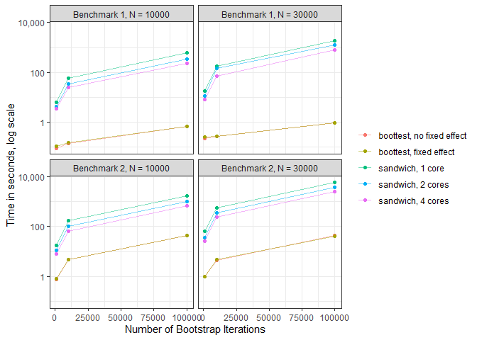

<!-- README.md is generated from README.Rmd. Please edit that file -->

# fwildclusterboot


<!-- badges: start -->
<!-- [, Funny-Looking Kid-orange.svg?style=flat-square)](commits/master) -->

[](https://github.com/ropensci/software-review/issues/546)
[](https://lifecycle.r-lib.org/articles/stages.html)
[](https://CRAN.R-project.org/package=fwildclusterboot)

[](https://github.com/s3alfisc/fwildclusterboot/actions)
[](https://app.codecov.io/gh/s3alfisc/fwildclusterboot?branch=master)
[](https://cran.r-project.org/package=fwildclusterboot)
[](https://cran.r-project.org/package=fwildclusterboot)

<!-- badges: end -->

The `{fwildclusterboot}` package implements multiple fast wild cluster
bootstrap algorithms as developed in [Roodman et al
(2019)](https://econpapers.repec.org/paper/qedwpaper/1406.htm) and
[MacKinnon, Nielsen & Webb
(2022)](https://www.econ.queensu.ca/sites/econ.queensu.ca/files/wpaper/qed_wp_1485.pdf).

Via the
[JuliaConnectoR](https://CRAN.R-project.org/package=JuliaConnectoR),
`{fwildclusterboot}` further ports functionality of
[WildBootTests.jl](https://github.com/droodman/WildBootTests.jl) - which
provides an even faster implementation of the wild cluster bootstrap for
OLS and supports the WRE bootstrap for IV and tests of multiple joint
hypotheses.

The package’s central function is `boottest()`. It allows to test
univariate hypotheses using a wild cluster bootstrap at extreme speed:
via the ‘fast’ algorithm, it is possible to run a wild cluster bootstrap
with $B = 100.000$ iterations in less than a second!



`{fwildclusterboot}` supports the following features:

-   The wild bootstrap for OLS (Wu 1986).
-   The wild cluster bootstrap for OLS (Cameron, Gelbach & Miller 2008,
    Roodman et al, 2019).
-   Multiple new versions of the wild cluster bootstrap as described in
    MacKinnon, Nielsen & Webb (2022), including the WCR13 (WCR-V), WCR31
    (WCR-S), WCR33 (WCR-B), WCU13 (WCU-V), WCU31 (WCU-S) and WCU33
    (WCU-B).
-   The subcluster bootstrap (MacKinnon and Webb 2018).
-   Confidence intervals formed by inverting the test and iteratively
    searching for bounds.
-   Multiway clustering.
-   One-way fixed effects.

Additional features are provided through `WildBootTests.jl`:

-   Highly optimized versions of the ‘11’ and ‘31’ wild cluster
    bootstrap variants
-   A highly optimized version of the Wild Restricted Efficient
    bootstrap (WRE) for IV/2SLS/LIML [(Davidson & MacKinnon,
    2010)](https://www.tandfonline.com/doi/abs/10.1198/jbes.2009.07221).
-   Arbitrary and multiple linear hypotheses in the parameters.

`{fwildclusterboot}` supports the following models:

-   OLS: `lm` (from stats), `fixest` (from fixest), `felm` from (lfe)
-   IV: `ivreg` (from ivreg).

### Installation

You can install compiled versions of`{fwildclusterboot}` from CRAN
(compiled), R-universe (compiled) or github by following one of the
steps below:

``` r
# from CRAN 
install.packages("fwildclusterboot")

# from r-universe (windows & mac, compiled R > 4.0 required)
install.packages('fwildclusterboot', repos ='https://s3alfisc.r-universe.dev')
# dev version from github
# note: installation requires Rtools
library(devtools)
install_github("s3alfisc/fwildclusterboot")
```

### The `boottest()` function

For a longer introduction to `{fwildclusterboot}`, take a look at the
[vignette](https://s3alfisc.github.io/fwildclusterboot/articles/fwildclusterboot.html).

``` r
library(fwildclusterboot)

# set seed via dqset.seed for engine = "R" & Rademacher, Webb & Normal weights
dqrng::dqset.seed(2352342)
# set 'familiar' seed for all other algorithms and weight types 
set.seed(23325)

data(voters)

# fit the model via fixest::feols(), lfe::felm() or stats::lm()
lm_fit <- lm(proposition_vote ~ treatment  + log_income + as.factor(Q1_immigration) + as.factor(Q2_defense), data = voters)
# bootstrap inference via boottest()
lm_boot <- boottest(lm_fit, clustid = c("group_id1"), B = 9999, param = "treatment")
summary(lm_boot)
#> boottest.lm(object = lm_fit, param = "treatment", B = 9999, clustid = c("group_id1"))
#>  
#>  Hypothesis: 1*treatment = 0
#>  Observations: 300
#>   Bootstr. Type: rademacher
#>  Clustering: 1-way
#>  Confidence Sets: 95%
#>  Number of Clusters: 40
#> 
#>              term estimate statistic p.value conf.low conf.high
#> 1 1*treatment = 0    0.079     3.983   0.001    0.039     0.119
```

## Citation

If you are in `R`, you can simply run the following command to get the
BibTeX citation for `{fwildclusterboot}`:

``` r
citation("fwildclusterboot")
#> 
#> To cite 'fwildclusterboot' in publications use:
#> 
#>   Fischer & Roodman. (2021). fwildclusterboot: Fast Wild Cluster
#>   Bootstrap Inference for Linear Regression Models. Available from
#>   https://cran.r-project.org/package=fwildclusterboot.
#> 
#> A BibTeX entry for LaTeX users is
#> 
#>   @Misc{,
#>     title = {fwildclusterboot: Fast Wild Cluster Bootstrap Inference for Linear Regression Models (Version 0.14.0)},
#>     author = {Alexander Fischer and David Roodman},
#>     year = {2021},
#>     url = {https://cran.r-project.org/package=fwildclusterboot},
#>   }
```

Alternatively, if you prefer to cite the “Fast & Wild” paper by Roodman
et al, it would be great if you mentioned `{fwildclusterboot}` in a
footnote =) !
